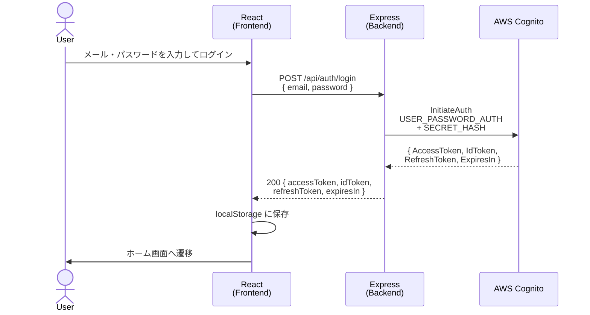
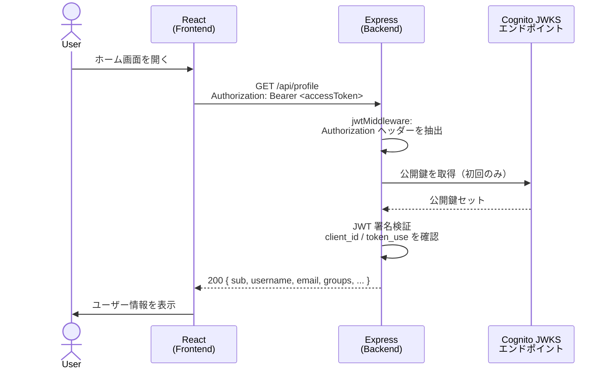
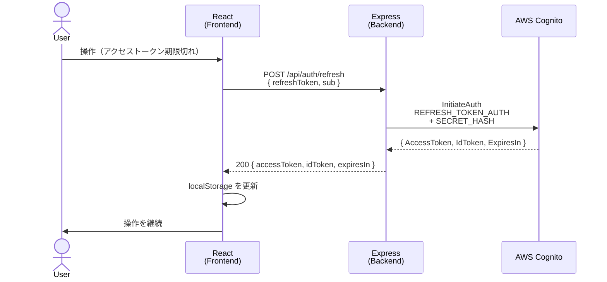
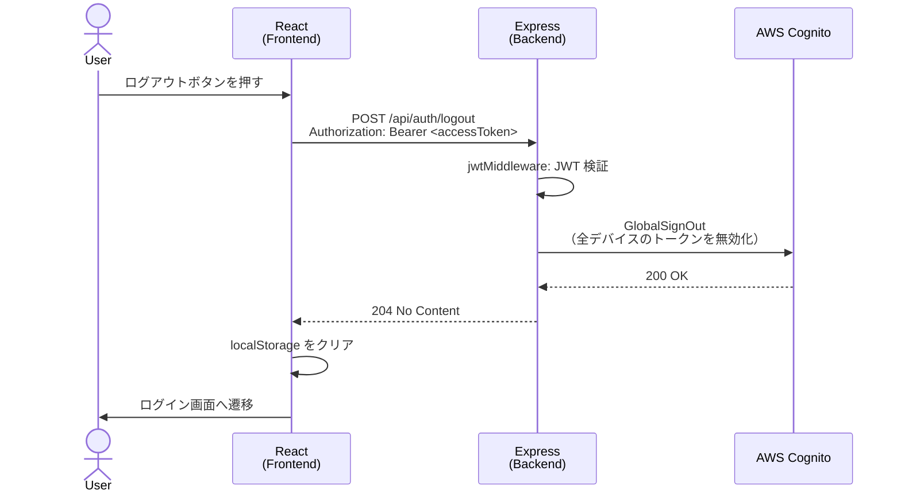

# cognito-jwt

AWS Cognito を使ったカスタムログインフォームと JWT 検証のサンプルアプリ。

フロントエンドは Cognito を直接知らず、バックエンドの `/api/*` とのみ通信する。バックエンドが AWS SDK で Cognito を呼び出し、JWKS で JWT を検証する。

## アーキテクチャ

```
React (カスタムフォーム)
  → POST /api/auth/login { email, password }
  → Express backend
  → AWS Cognito InitiateAuth (USER_PASSWORD_AUTH)
  ← { accessToken, idToken, refreshToken, expiresIn }
  ← localStorage に保存

React
  → GET /api/profile (Authorization: Bearer <accessToken>)
  → Express が JWKS で JWT を検証
  ← ユーザー情報 (sub, email, groups など)
```

## シーケンス図

### ログイン



### 保護リソースへのアクセス



### トークンリフレッシュ



### ログアウト



## ディレクトリ構成

```
cognito-jwt/
├── package.json                    # npm workspaces + concurrently
├── backend/
│   ├── src/
│   │   ├── index.ts                # Express エントリポイント
│   │   ├── config.ts               # 環境変数の読み込み
│   │   ├── middleware/
│   │   │   ├── corsMiddleware.ts   # CORS 設定
│   │   │   └── jwtMiddleware.ts    # jose で JWT 検証
│   │   ├── routes/
│   │   │   ├── authRouter.ts       # /api/auth/login, /refresh, /logout
│   │   │   └── profileRouter.ts    # /api/profile
│   │   └── services/
│   │       └── cognitoService.ts   # AWS SDK 呼び出し + SECRET_HASH 計算
└── frontend/
    └── src/
        ├── api/authClient.ts       # fetch ラッパー
        ├── auth/
        │   ├── AuthContext.tsx     # トークン状態を React Context で管理
        │   └── useAuth.ts
        ├── components/
        │   └── ProtectedRoute.tsx  # 未認証なら /login へリダイレクト
        └── pages/
            ├── LoginPage.tsx       # カスタムログインフォーム
            └── HomePage.tsx        # /api/profile の結果を表示
```

## 前提条件

- Node.js 20 以上
- AWS アカウントと Cognito ユーザープール
- AWS CLI（テストユーザー作成時に使用）

## Cognito ユーザープールの設定

### ユーザープール作成時の設定

| 項目 | 設定値 |
|---|---|
| サインイン識別子 | **メールアドレス** |
| 自己登録 | 無効（任意） |
| 必須属性 | `email` |
| Hosted UI | **使用しない** |

### App Client の設定

| 項目 | 設定値 |
|---|---|
| 認証フロー | `ALLOW_USER_PASSWORD_AUTH` ✅ |
| 認証フロー | `ALLOW_REFRESH_TOKEN_AUTH` ✅ |
| クライアントシークレット | 生成する場合は `.env` に設定 |

> `ALLOW_USER_PASSWORD_AUTH` を有効にしないと `InitiateAuth` が失敗する。

### テストユーザーの作成

Cognito コンソールの「ユーザーを作成」で以下を設定すると、確認済み状態で作成できる：

- 招待メッセージ: **「招待を送信しない」**
- パスワード: **「パスワードを設定する」**（一時パスワードではなく永続パスワード）

または AWS CLI:

```bash
aws cognito-idp admin-create-user \
  --user-pool-id ap-northeast-1_XXXXXXXXX \
  --username user@example.com \
  --temporary-password "Temp1234!" \
  --message-action SUPPRESS

aws cognito-idp admin-set-user-password \
  --user-pool-id ap-northeast-1_XXXXXXXXX \
  --username user@example.com \
  --password "MyPassword1!" \
  --permanent
```

## セットアップ

```bash
# 依存関係のインストール
npm install

# 環境変数の設定
cp backend/.env.example backend/.env
cp frontend/.env.example frontend/.env
```

`backend/.env` を編集して Cognito の値を設定する：

```env
COGNITO_REGION=ap-northeast-1
COGNITO_USER_POOL_ID=ap-northeast-1_XXXXXXXXX
COGNITO_CLIENT_ID=xxxxxxxxxxxxxxxxxxxxxxxxxxxx
COGNITO_CLIENT_SECRET=          # App Client にシークレットがある場合のみ設定
PORT=3000
CORS_ORIGIN=http://localhost:5173
```

`frontend/.env` はデフォルトのままで動作する：

```env
VITE_API_BASE_URL=http://localhost:3000
```

## 起動

```bash
npm run dev
```

- フロントエンド: http://localhost:5173
- バックエンド: http://localhost:3000

## API エンドポイント

| Method | Path | 説明 |
|---|---|---|
| POST | `/api/auth/login` | `{ email, password }` → Cognito InitiateAuth → tokens |
| POST | `/api/auth/refresh` | `{ refreshToken, sub }` → REFRESH_TOKEN_AUTH → new tokens |
| POST | `/api/auth/logout` | Bearer token → GlobalSignOut → 204 |
| GET | `/api/profile` | Bearer token → JWT 検証 → ユーザー情報 |

## 動作確認

1. http://localhost:5173/login にアクセス → カスタムログインフォームが表示される
2. Cognito に登録済みのユーザーでログイン → ホームページへ遷移
3. ブラウザの Network タブで `POST /api/auth/login` → `GET /api/profile` の流れを確認
4. ホームページで JWT クレームから取得したユーザー情報が表示される
5. ログアウトボタンで Cognito GlobalSignOut が呼ばれ `/login` へ戻る

## 実装の重要ポイント

### SECRET_HASH

App Client にクライアントシークレットがある場合、全 `InitiateAuth` 呼び出しに `SECRET_HASH` が必要。

```
Base64(HMAC-SHA256(username + clientId, clientSecret))
```

`COGNITO_CLIENT_SECRET` が設定されている場合のみ自動的に計算・付与される。

### JWT 検証

`jose` ライブラリの `createRemoteJWKSet` を使い、Cognito の JWKS エンドポイントから公開鍵を取得して検証する。キャッシュと自動ローテーションに対応している。

```
https://cognito-idp.{region}.amazonaws.com/{userPoolId}/.well-known/jwks.json
```

アクセストークンの検証では `client_id` クレームと `token_use: "access"` を確認する（Cognito アクセストークンは `aud` クレームを持たない）。

### トークンの保管

このサンプルでは `localStorage` に保存しているが、XSS 攻撃でスクリプトから読み取られるリスクがある。本番環境では `httpOnly Cookie` が推奨される（JS からアクセス不可）。

## cognito-hosted-ui との対比

| 項目 | cognito-hosted-ui | cognito-jwt（このプロジェクト） |
|---|---|---|
| ログイン UI | Cognito Hosted UI | カスタム React フォーム |
| Cognito を呼ぶのは誰 | ブラウザ（リダイレクト） | Express バックエンド |
| 認証フロー | authorization_code + PKCE | USER_PASSWORD_AUTH |
| フロントが Cognito を知る | Yes | No（`/api/*` のみ） |
| JWT 検証 | なし | jose + JWKS でバックエンド検証 |
| トークン保管 | sessionStorage | localStorage |
| ログアウト | Cognito /logout リダイレクト | GlobalSignOut（バックエンド経由） |
